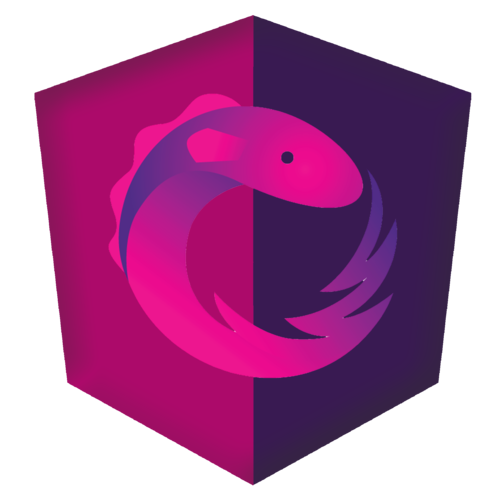
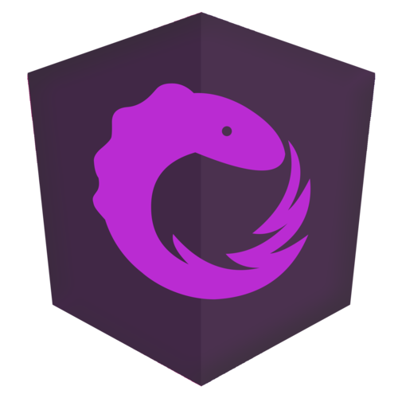

<head>
	<link rel="stylesheet" href="css/style.css">
</head>
 
# Hi there 👋 I'm a Front-end developer

## Contact

 

## Technology stack

## Front-end

## Learning

## Tools

## Seldom I use

## 𝗦𝘁𝗮𝘁𝘀

