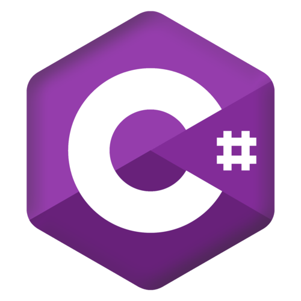
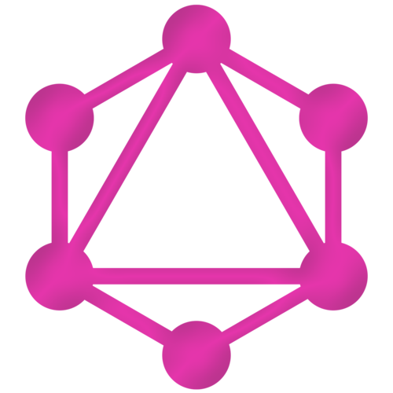
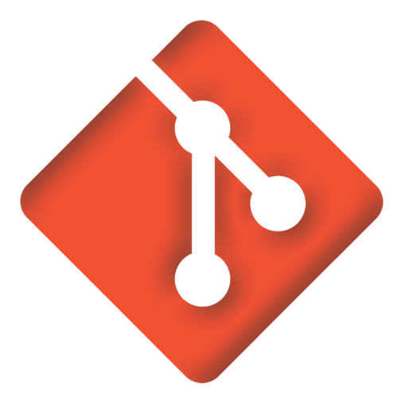

<head>
	<link rel="stylesheet" href="css/style.css">
</head>
 
# Hi there 👋 I'm a Developer

## Contact

## Technology stack

### Front-End

	

### Back-End

### API

### Tools

### Seldom I use

<!--
### 𝗦𝘁𝗮𝘁𝘀

 

 

-->

